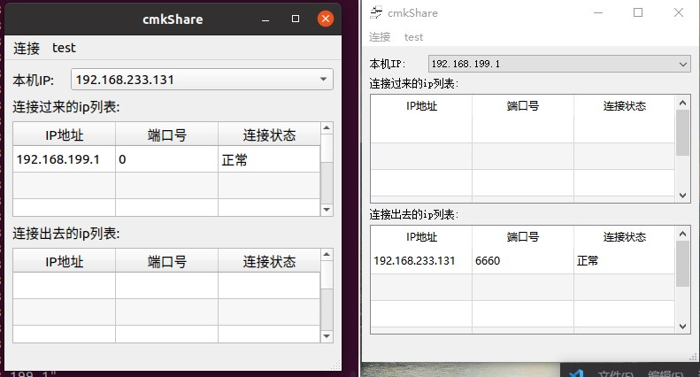
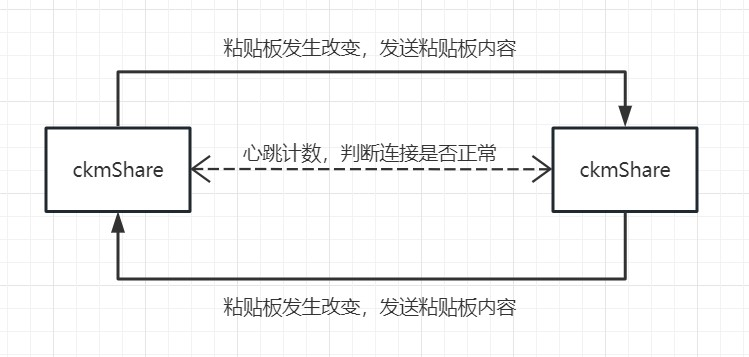

# ckmShare

同局域网下两台电脑共享粘贴板。共享复制粘贴内容。

## 可共享粘贴板内容

- [x] 文字
- [x] 图片
- [ ] 文件

## 通讯流程

发送端检测到粘贴板内容发生变更，发送粘贴板内容（文字通过UDP，图片/文件通过TCP文件传输）；接收端接收内容写入粘贴板。两个建立连接的程序会不断通过UDP发送心跳计数，确定连接是否断开。

### 建立连接流程

A端(新建连接)发送连接请求-->B端接收到连接请求,回应连接-->A端接收到,连接建立完成

### UDP消息内容

图片/文件内容以tcp方式传输
|动作|UDP内容|
| - | -- |
|连接|ckmshare;connect;本机IP;数据传输端口号(TCP)|
|回应连接|ckmshare;connect2;本机IP;数据传输端口号(TCP)|
|心跳|ckmshare;heartbeat;本机IP|
|回应心跳|ckmshare;heartbeat2;本机IP|
|文本粘贴内容|ckmshare,text;本机IP;文本数据|
|图片|ckmshare;image;本机IP|
|文件|ckmshare;file;本机IP|
